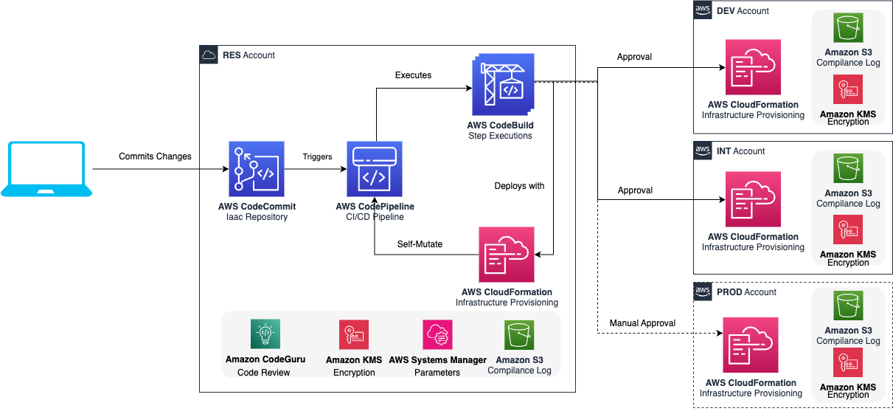
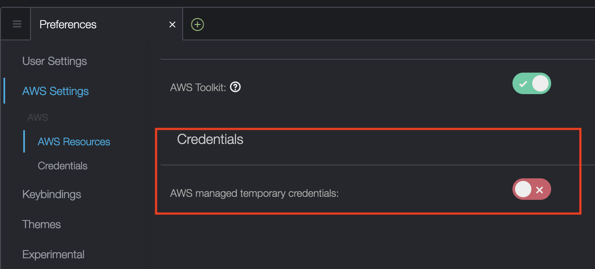

# Welcome to the CI/CD Boot also known as Vanilla Pipeline

This repository contains the infrastructure as code to bootstrap your next CI/CD project. It is developed with security best practices in mind, provides a robust and automated deployment process that utilizes a combination of CDK Stacks primarily written in TypeScript. It also deploys sample Python Lambda functions. The code is structured in the following way (check the comments, they are important for the future updates):
```bash
├── bin
├── config
├── docs
├── lib
│   ├── cdk-pipeline
│   │   ├── app ### here you need to initialize the cdk-stacks you add in the lib/stacks/app
│   │   └── core ### avoid doing changes here in order to keep the update path
│   └── stacks
│       ├── app ### here you define new CDK Stacks which you want to deploy
│       └── core ### avoid doing changes here in order to keep the update path
├── scripts
│   └── tests ### extend and add new
├── src
│   ├── codebuild
│   ├── lambda-functions
│   │   └── test ### extend and add new functions as you see fit
│   └── lambda-layer
│       └── common ### add more packages to requirements.txt
├── test
└── utils
```

## Local Environment Requirements

You need to have the following dependencies in place:

- AWS Account (RES/DEV/INT/PROD)
- Mac OS / Cloud9 with Ubuntu Server 22.04 LTS Platform in RES Account
- Bash/ZSH terminal
- Docker version 24.0.x
- aws-cli v2 [here](https://docs.aws.amazon.com/cli/latest/userguide/getting-started-install.html)
- AWS credentials and profiles for each environment under ~/.aws/config [here](https://docs.aws.amazon.com/cli/latest/userguide/cli-configure-files.html)
- Node v18.17.* && NPM v10.2.*
- Python >= 3.11
- Pipenv 2023.* [here](https://pipenv.pypa.io/en/latest/)
- jq command line JSON processor jq-1.5


## Deployment Architecture



## Components

AWS CDK (Cloud Development Kit) scripts to create:

- KMS CMK keys used for the storage encryption
- A CodeBuild and a CodePipeline project to automate the deployment process
- A sample Lambda Stack which includes also a Lambda Layer for ```manylinux2014_x86_64``` platform with some of the most common python libraries, e.g: openssl, pandas and confluent-kafka which shows how to deploy a hello world Lambda function from CDK

## Getting started

In order to use CDK to deploy the CICD Boot you need to first install CDK. Instructions how to install can be found [here](https://docs.aws.amazon.com/cdk/latest/guide/getting_started.html)
For a more detailed and in-depth explanation on what CDK is and how to use it with TypeScript please refer to this workshop [here](https://cdkworkshop.com/20-typescript.html)

### Initial Deployment Requirements

#### Github
To use the CICD Boot for repositories hosted on GitHub you need to establish an AWS CodeStar Connection and use the arn of that connection the next steps.

The existing AWS CodeStar Connections can be checked on the [Console](https://console.aws.amazon.com/codesuite/settings/connections) or in the CLI with the following command:

```bash
aws codestar-connections list-connections --profile ${RES_ACCOUNT_AWS_PROFILE}
```

If you do not have the AWS CodeStar connection ready please check on how to configure it [here](./docs/prerequisites-github-codestarconnection.md).

### Optional: Determine VPC and Proxy settings for your pipeline
By default, the Pipeline is configured to run **without** a VPC. To run inside a VPC, there are two options: `VPC` and `VPC_FROM_LOOK_UP`. These options are configured using `scripts/configure.sh` described in the next section.

Use `VPC` if you want a single, self-contained pipeline running in a VPC. Not recommended for use with multiple code pipelines in the same account. The VPC is created using defaulted settings.

Use `VPC_FROM_LOOK_UP` to look up an existing VPC based on its vpc ID. It is recommended to create this VPC prior to deploying the pipeline. Multiple deployments of the pipeline can share the same VPC.

Note: Switching between VPC options may require a complete tear down and redeploy of the pipeline

Proxy Configuration requires proxy information to be stored in Secrets manager. Make note of the secret arn is needed in the next step.

### Prepare the local Environment

Prepare local environment with the help of the CICD Boot Setup tool. Start by running the `./scripts/configure.sh` command and follow the instructions. Check in the Appendix for detailed instructions.

#### After you modify the placeholders in the script, make it executable and source those variables:

```bash
chmod +x export_vars.sh
source export_vars.sh
```

#### Install all the required npm dependencies for CDK:

```bash
npm ci ### it installs the frozen dependencies from package-lock.json
```

### Required
Amazon S3 server access logging is a security best practice and should be always enabled. The compliancy logs configuration gets applied to S3 buckets in the bin/aspects.ts for each stage RES/DEV/INT.

Make sure that the destination bucket has policy granting `s3:PutObject` permissions to the logging service principal `logging.s3.amazonaws.com` ([see documentation](https://docs.aws.amazon.com/AmazonS3/latest/userguide/enable-server-access-logging.html)).

If you do not have compliance log buckets, then the CICD Boot will automatically create them outside of the scope of your current project. The S3 Buckets will be named as configured in the AppConfig.ts

### Bootstrap stages

#### Prepare the RES stage

```bash
npm run cdk bootstrap -- --profile $RES_ACCOUNT_AWS_PROFILE --qualifier ${CDK_QUALIFIER} aws://${ACCOUNT_RES}/${AWS_REGION}
```

#### Prepare the DEV stage

```bash
npm run cdk bootstrap -- --profile $DEV_ACCOUNT_AWS_PROFILE  --qualifier ${CDK_QUALIFIER} --cloudformation-execution-policies \
arn:aws:iam::aws:policy/AdministratorAccess \
--trust ${ACCOUNT_RES} aws://${ACCOUNT_DEV}/${AWS_REGION}
```

#### Prepare the INT stage

```bash
npm run cdk bootstrap -- --profile $INT_ACCOUNT_AWS_PROFILE --qualifier ${CDK_QUALIFIER} --cloudformation-execution-policies \
arn:aws:iam::aws:policy/AdministratorAccess \
--trust ${ACCOUNT_RES} aws://${ACCOUNT_INT}/${AWS_REGION}
```

#### Prepare the PROD stage
*The code below won't run by copy/paste, please update the variables accordingly.
*Make sure to also update scripts/warming.sh with the information for the ACCOUNT_PROD same as used for DEV/INT.
*Make sure to check also the AppConfig.ts on how to enable PROD stage as there you also need to export more environment variables which are then used to propagate the ACCOUNT_PROD to the CDK Pipeline.

```bash
npm run cdk bootstrap -- --profile prod --qualifier ${CDK_QUALIFIER} --cloudformation-execution-policies \
arn:aws:iam::aws:policy/AdministratorAccess \
--trust resources_account_id aws://prod_account_id/your_aws_region
```

#### Deploy all the stacks

```bash
npm run cdk deploy -- --all --region ${AWS_REGION} --profile $RES_ACCOUNT_AWS_PROFILE --qualifier ${CDK_QUALIFIER}
```

Once the command finishes there will be the following CDK Stacks deployed into your RES Account:
- PipelineRepository -> Responsible for either:
    - creating the CodeCommit repository (if you have it selected in config/AppConfig.ts) and the PullRequest automation behind CodeCommit to support scanning with CodeGuru and also run a set of configured commands same as the pipeline does in the Build phase.
    - establishing the CodeStar connection between your AWS RES Account and the configured Github repository.
- SSMParameterStack  -> Responsible for creating the parameters in the SSM Parameter Store, e.g: Account IDs.
- VPCStack -> Responsible for enabling the running of the build stages of the pipeline in a VPC, with or without a proxy. By default this stack is not going to be created unless configured via `configure.sh`. Check [here](#configure-vpc-and-proxy-setting-for-your-pipeline) for more information on the possible configurations.
- EncryptionStack -> Responsible for creating the KMS Key used to encrypt all the created CW Log Groups.
- PipelineStack   -> Responsible for creating the CodeCommit Repository and the CodePipelineStack with all the CodeBuild Steps

In the other configured stages (DEV/INT/PROD/...) there will be the following example stacks deployed:
- LambdaStack -> Deploys an example Lambda function which comes bundled with an example Lambda Layer containing the specified dependencies in the requirements.txt
- S3BucketStack -> Deploys an example S3 bucket which enforces KMS encryption and RetentionPolicy
- MonitoringStack -> Deploys an example Monitoring stack which you can modify and enable/disable the services by updating the ```monitoring.monitorScope```. Read the official cdk construct documentation [here](https://github.com/cdklabs/cdk-monitoring-constructs).

### [CODECOMMIT] Push the local repository to remote

In case you are using CodeCommit then you need to configure the downstream of the repository for deployment. In your local machine you need to install the ```git-remote-codecommit``` using the following command:
```bash
sudo pip3 install git-remote-codecommit
```

```bash
CURRENT_BRANCH=$(git rev-parse --abbrev-ref HEAD);
git remote add downstream codecommit::${AWS_REGION}://${RES_ACCOUNT_AWS_PROFILE}@${GIT_REPOSITORY};
git commit -am "feat: init downstream";
git push -u downstream ${CURRENT_BRANCH}:main ### default branch for CodePipeline can be configured in config/AppConfig.ts
```

## Validate packages

If you install new dependencies, please update `package-verification.json` by running the following commands:

```bash
rm -rf node_modules ### remove the locally downloaded npm dependencies
npm install  ### install fresh from the package.json, this will generate package-lock.json as well
npm run validate:fix ### will generate the checksum for the package-lock.json which is checked in the CI/CD
npm run audit:fix:license ### will update the NOTICE file with the updated package versions
```

## Playbooks

### Troubleshooting common deployment problems

1. In case the build phase failed - one needs to inspect the execution details of the build job in AWS CodeBuild.
2. In the details logs identify which part of the build job failed (search for text marked in red). In the red marked text you will find information why the build job failed.
3. In case one of the build stages fails - one needs to login to the AWS account for the failed stage(Dev, Int or Prod) and inspect the CloudFormation Events.
4. In the Status Reason of the failed events you will find why the CloudFormation update failed.
5. Analyse the message what went wrong and apply a fix
6. In case the fix is not trivial and it needs more sophisticated research - revert to the last known working state in Git
7. Search for the last commits and identify a working one using git log | less. Copy the git hash to your clipboard
8. Do a git checkout working state hash && git push
9. Validate the new deployment for correctness

## Create/update NOTICE file
NOTICE file **must** be kept up to date in the repository.

NOTICE file consistency is tested by the `npm run audit:license`, this script is included into the CodePipeline Build step to ensure the NOTICE file is always up-to-date.

The script checks dependencies in `package.json` for NPM, `Pipfile` and `requirements.txt` for Python projects. In case, you are using other package managers, you need to manage those dependencies by **yourself** as long as that is not supported by CICD Boot.

The used dependencies can be dependent on the Operating System and the runtime environment so for this reason the NOTICE file can be different in case it is generated on a different location.

To update the NOTICE file locally you need to run the following command:

```bash
npm run audit:fix:license
```

**Note**
This will only result with new Notice file generation in case any of the `package.json` for NPM, `Pipfile` and `requirements.txt` for Python projects has been modified. While the files are untouched the license is considered up to date.

### Configuration options
We have listed a set of example licenses which are in general prohibited if you plan to deploy anything to production systems and keep the code private. You can change these licenses anytime by updating the ```licensecheck.json``` file.

Example configuration:

```json
{
    "failOnLicenses": ["AGPL"],
    "npm": {
        "excluded": [],
        "excludedSubProjects": ["./example/package.json"]
    },
    "python": {
        "allowedTypes": ["Pipenv"],
        "excluded": [],
        "excludedSubProjects": ["./example/Pipfile"]
    }
}
```

* Banned licenses can be listed on the `failOnLicenses` attribute. The license name match is case sensitive.
* Sub folder which `Pipfile` or `package.json` file should not be included into the License check should be listen under the `npm.excludedSubProjects` or `python.excludedSubProjects` attributes.
* For NPM packages the subfolder also needs to contain a package-lock.json file to ensure the right dependencies will be installed and checked.
* Dependencies can be excluded from the license verification for NPM and Python as well.
* Python has many package management solution. The Vanilla Pipeline supports `Pipenv` and the regular `requirements.txt`
 files. With the ```licensecheck.json``` file `python.allowedTypes` allows to configure which packageManager package types considered. The values are `Pipenv`, and the `requirements.txt`. 

## Appendix

#### Commit Messages

By default we have enabled the commit-msg hook via [husky](https://typicode.github.io/husky/) which comes installed by default when you first run ```npm ci```. We are enforcing the convention described in [conventionalcommits](https://www.conventionalcommits.org/en/v1.0.0/) by default for the commit messages to help make the collaboration between team members transparent and consistent. In case you have commit messages that do not follow that convention then you won't be able to commit your changes from your local machine. Check the example below:
*WRONG COMMIT MESSAGE*
```bash
> git commit -m "foo: this will fail"

> cicd-boot@1.0.4 commitlint
> commitlint --edit

⧗   input: foo: this will fail
✖   type must be one of [build, chore, ci, docs, feat, fix, perf, refactor, revert, style, test] [type-enum]

✖   found 1 problems, 0 warnings
ⓘ   Get help: https://github.com/conventional-changelog/commitlint/#what-is-commitlint

husky - commit-msg hook exited with code 1 (error)
```

*CORRECT COMMIT MESSAGE*
```bash
> git commit -m "docs: updated README.md with better instructions for the commit-msg hook"

> cicd-boot@1.0.4 commitlint
> commitlint --edit .git/COMMIT_EDITMSG

[feat/developer-tools 24192d7] docs: updated README.md with better instructions for the commit-msg hook
 1 file changed, 1 insertion(+), 1 deletion(-)
```

#### Enable running pre-commit hooks
There are pre-commit hooks installed by default but not enabled. If you want to enable running them on every git commit then you need to export the following env variable in your CLI:

```bash
export RUN_PRE_COMMIT_HOOKS=true
```

#### Details of Environment Variables configured by configure.sh

The `scripts/configure.sh` script uses a series of prompts and user input to build a bash script that can be used to `source` your environment variables into your active shell/terminal. Additionally, the configure script sets values in the config section of the `package.json` file. The created `export_vars.sh` can be modified or duplicated to assist developers moving between potentially different test environments. For details of how Environment variables are used, see `AppConfig.ts` 

For more information, see [CONFIGVARS](CONFIGVARS.md)

#### Add/remove cdk.context.json to git remote
When you use a construct's .fromLookup() method, the result of the call is cached in cdk.context.json. You should commit this to version control along with the rest of your code to make sure that future executions of your CDK app (in the pipeline) use the same value. The CDK Toolkit includes commands to manage the context cache, so you can refresh specific entries when you need to. For more information, see [Runtime context](https://docs.aws.amazon.com/cdk/v2/guide/context.html). In case you have put cdk.context.json to .gitignore to avoid committing your test account ids by mistake then you need to:
```bash
### 1. Remove cdk.context.json from .gitignore
vi .gitignore ### remove cdk.context.json
### 2. Generate the cdk.context.json
source exports_vars.sh ### source the env vars with the right account ids and profiles for RES/DEV/INT/PROD...
npm run cdk synth ### this command generates the cdk.context.json
### 3. Add the cdk.context.json to git remote
git add cdk.context.json ### re-add cdk.context.json
git commit -am "feat: re-added cdk.context.json"
git push -u origin ### Push changes to remote

```

### Working with Python dependencies
The project utilizes the [Pipenv](https://pipenv.pypa.io/en/latest/). Pipenv automatically creates and manages a virtualenv for your project, as well as adds/removes packages from your `Pipfile` as you install/uninstall packages. It also generates a project `Pipfile.lock`, which is used to produce deterministic builds.

The Python dependencies should be maintained in `Pipfile` instead of the `requirements.txt` file and requirements.txt files usage should be avoided.

#### How to install Pipenv
The recommended approach is to use `pip install pipenv -U` command. More information can be found [here](https://pipenv.pypa.io/en/latest/installation/#installing-pipenv). 

The `pipenv` command is not added to the $PATH by default, that needs to be done manually. The `pipenv` command location can be determined by executing the following:
```bash
python3 -m site --user-base
```
This will return a value like `/Users/user/Library/Python/3.11`. Then the $PATH needs to be extended with the `/Users/user/Library/Python/3.11/bin`.

```bash
export PATH="${PATH}:/Users/user/Library/Python/3.11/bin";
```

You can add this to your `$HOME/.zshrc` or `$HOME/.bashrc` to have this folder permanently available.

#### Migrating existing `requirements.txt`
Existing `requirements.txt` can be transformed into a `Pipfile` with the `pipenv install` command, e.g:

```bash
cd path-to-the-module
pipenv install -r requirements.txt && pipenv lock
```

`Pipfile` has to be created where the `requirements.txt` would be created. That folder will be considered as a Python module.

#### Installing a new dependency
The `pipenv` command install api is identical as the `pip` commands.

```bash
pipenv install <dependency>
```

#### Updating lock file
The `Pipfile.lock` can be updated with the `pipenv lock` command.

#### Installing dependencies based on the `Pipfile.lock`
The locked dependencies can be installed with the locked version with the `pipenv sync` command.

### Create a new project
Prepare a new project with the `./scripts/configure.sh` and prompt yes for the first question regarding new project creation. 'Creating a new pipeline project?' prompt yes and then follow the instructions. Once the setup finished,

1. Ensure `export_vars.sh` is created and the values are correct.
2. Follow the steps of the [Required](#required) and [Bootstrapping](#bootstrap-stages)
3. [Deploy](#deploy-all-the-stacks) all the stacks
4. Commit the modified files and push your changes to the **CORRECT** (not the cicd-boot) repository.

#### Multiple CICD Boot repositories in same AWS Account(s)
If you want to deploy multiple CICD Boot pipelines on the same AWS Account you need to make sure they are namespaced differently. If you just clone/fork this repository and deploy the same code in into multiple repositories in the same AWS Account you will have conflicting CloudFormation stacks deployed as they are all namespaced with ```cicdboot``` or ```CICDBoot```. In order to use different qualifier for the deployment as well as different Application Name please please refer to the section in details: [Change the cicdboot qualifier](#change-the-cicdboot-qualifier)

## Change the cicdboot qualifier
If you want to use another qualifier other than cicdboot then you need to use the `./scripts/configure.sh` script to reconfigure the project.
Changing the qualifier requires recreation of the deployed resources, so sure to first delete the following stacks in your RES/DEV/INT/PROD accounts and then do new bootstrapping.

If you bootstrapped by mistake with the default qualifier then make sure to first delete the following stacks in your RES/DEV/INT/PROD accounts and then do new bootstrapping.

Notes:
 - ```CDKToolkit-cicdboot``` (this has an exported parameter which collides with the new one in the new CDKToolkit-${newQualifier})
 - Delete the cdk-assets S3 bucket after the stack deletion to not incur any costs

## Keeping CICD Boot forks up-to-date
Keeping your CICD Boot forks up to date is a good practice as you benefit from the new features and bug fixes introduced by the new versions. CICD Boot team actively puts a lot of effort into releasing continuously new versions. We document the new features, common workflows, and changes, all this as part of the [CHANGELOG](./CHANGELOG.md). Migration steps between versions are as well documented and all this is done following the [Semantic Versioning](http://semver.org/). This helps the CICD Boot consumers to quickly understand the impact of the version upgrades. In any case, updates are optional only controlled by **the responsible pipeline owners**.

### How to safely update to a version
1. Check the [CHANGELOG](./CHANGELOG.md) and check carefully the version changes to note down any BREAKING CHANGE introduced by the update.
2. In case your current version is more than 1 release behind the recommendation is as always to do sequential updates and carefully check the CHANGELOG.md
3. Before starting the update, make sure you have your repository and the deployed pipeline in a stable state and also make sure to select the right branch. Use `git commit` or `git stash` to clean the state.
4. Select the new version and use the `git merge` command to update to that new version.
5. Ensure the changes have been merged and pushed to the remote repository.
6. Verify that the pipeline has been updated correctly and its execution finished with the expected result (pipeline GREEN).

Example commands for updating:
```bash
CICD_BOOT_REMOTE=origin; # Ensure the right git remote alias is set, we are assuming "origin" in this case
VERSION_TO_UPDATE_TO=1.1.2;

git merge ${CICD_BOOT_REMOTE}/${VERSION_TO_UPDATE_TO};

## Resolve Merge conflicts in case there are any, then commit the changes
# git add .
# git commit -m "Updated to v1.1.2"
```

## Static Application Security Testing (SAST)
The project applies the Day 0 mentality in Security. This means there are clearly defined Quality Gates defined in the pipeline where Security is checked and enforced to support the highest security standards for any project that uses the CICD Boot as base. The quality checks are applied as early as the Pull Requests, and brings you a wide range of built-in tools that you can opt in or out as your project needs.

For more information, see [SECURITY](SECURITY.md)

## Known Issues
Check below the list of all the known issues for which we do not yet have a final fix and/or take longer than 1 release cycle to completely fix them:
- **⚠ CodeCommitRepositoryConstruct: NODEJS_16_X support** If you are using AWS CodeCommit as repository type in your package.json (by setting "repositoryType": "CODECOMMIT") you need to know that we have overriden the Lambda runtime from NODEJS_14_X to NODEJS_16_X and also suppressed the false positive warnings for all the resources coming from the following construct: `CodeCommitRepositoryConstruct` in a separate construct: `CodeCommitRepositoryAspects` utilizing the [Aspects](https://docs.aws.amazon.com/cdk/v2/guide/aspects.html). The NODEJS_16_X runtime will be deprecated on Jun 12, 2024. This means that if you want to deploy new pipelines using CodeCommit the `CodeCommitRepositoryConstruct` will fail to deploy, the existing deployments won't be affected. Until we have a fix the only easy solution is the minimum version overriding from NODEJS_14_X to NODEJS_16_X (the overriding to NODEJS_18_X is not compatible to be done in this way, hence not done).


## Common Issues
Check below the list of potential issues you might encounter due to misconfigurations of your local environment when developing on top of the CICD Boot:
- When using Cloud9 in RES account and want to deploy the code cross-account then you need to define the profiles for the DEV and INT Account as usual (adding them in the ~/.aws/config). The RES profile can be omitted in this case while doing the initial bootstrap, except for the DEV and INT or PROD stages where the profile is mandatory to establish the trust between the RES account and the other environments (DEV/INT/PROD).
- `when calling the PutParameter operation: The security token included in the request is invalid`: This usually happens if you use Cloud9. Make sure to disable AWS managed temporary credentials and give the full admin access to your Cloud9 Managed role in order to be able to execute everything necessary. See the screenshot here: 
- `Resource handler returned message: "Policy contains a statement with one or more invalid principals. (Service: Kms, Status Code: 400, Request ID: a9f9e73b-cf2c-4862-9536-af92aa0ed656)" (RequestToken: 949e9034-f910-7eb3-a4a2-427bc9e676b9, HandlerErrorCode: InvalidRequest)`
- Make sure that the role you are trying to add to the policy exists in the given account.
- If you get `InvalidLocationConstraint` error during bucket creation, while executing `aws s3api create-bucket`
command, then consider removing `--create-bucket-configuration LocationConstraint` parameter. This error usually occurs
if the default region is the same as the one set in the LocationConstraint.
- If the pipeline fails with `AccessDeniedException` error or lacks any AWS resources, then this might be caused by the
wrong region setup. In this case some resources are deployed into another region. Check the region value that is set in
the ```export_vars.sh``` when you initially created the script or your cli env var ```AWS_REGION```. The region should
be consistent across those files.
- Make sure the `CDK_QUALIFIER` meets the requirement of [CDK](https://github.com/aws/aws-cdk/issues/9255) - Qualifier must be an alphanumeric identifier of at most 10 characters
- If you have already deployed RES/DEV/INT and want to disable INT then please do the following:
  ```bash
  export ACCOUNT_INT="-"
  npm run cdk deploy -- --all --region ${AWS_REGION} --profile $RES_ACCOUNT_AWS_PROFILE --qualifier ${CDK_QUALIFIER}
  ```
  After performing this please do not forget to delete your CloudFormation resources on the previous INT Account.
- `validation error detected: Value 'log-retention-..........-.......-...-DEV' at 'roleName' failed to satisfy constraint: Member must have length less than or equal to 64`: This usually happens if you use longer `applicationName` in the `config/AppConfig.ts` than 20 characters. In this case, you either use different application name or modify the log retention role in the [LogRetentionRoleStack](lib/stacks/core/LogRetentionRoleStack.ts).
​

## CDK Useful commands

* `npm ci`                              install the packages from the frozen dependencies in the package-lock.json
* `npm run build`                       compile typescript to js
* `npm run watch`                       watch for changes and compile
* `npm run test`                        perform the jest unit tests
* `npm install`                         installs an npm package (make sure to run the npm run validate:fix afterwards)
* `npm run validate:fix`                generate checksum of the package-lock.json (after installing new dependencies)
* `npm run validate`                    validate the checksum of the package-lock.json
* `npm run audit`                       audits the project dependencies (both NPM and Python dependencies), source code with static code analyses
* `npm run audit:deps:nodejs`           audits NPM dependencies
* `npm run audit:deps:python`           audits Python dependencies
* `npm run audit:scan:security`         perform static security checks (semgrep, bandit, shellcheck)
* `npm run audit:license`               validate the NOTICE file
* `npm run audit:fix:license`           update the NOTICE file of the project
* `npm run license`                     validate the NOTICE file
* `npm run license:default`             validate the NOTICE file on Linux systems
* `npm run license:macos`               validate the NOTICE file on MacOS systems
* `npm run lint`                        check for linting issues in the project
* `npm run lint:fix`                    fix linting issues in the project (do not forget to add & commit the fixed files)
* `npm run cdk deploy -- --all`         deploy all stacks to your configured AWS account/region
* `npm run cdk diff`                    compare deployed stack with current state
* `npm run cdk synth -- --all`          emits the synthesized CloudFormation template for all stacks

## Pointers to external documentation

- [AWS CDK documentation](https://docs.aws.amazon.com/cdk/api/latest/typescript/api/index.html)
- [AWS CDK Workshop for TypeScript](https://cdkworkshop.com/20-typescript.html)
- [AWS CDK Best Practices Context](https://docs.aws.amazon.com/cdk/v2/guide/best-practices.html#best-practices-apps-context)
- [AWS CDK NAG](https://github.com/cdklabs/cdk-nag)
- [Manage application security and compliance with the AWS Cloud Development Kit and cdk-nag](https://aws.amazon.com/blogs/devops/manage-application-security-and-compliance-with-the-aws-cloud-development-kit-and-cdk-nag/)

## Security

CICD Boot scans IaC (Infrastructure as Code) using CDK NAG. Please add your own scanner, if you use IaC languages other than CDK.

[Software Composition Analysis (SCA)](https://owasp.org/www-project-devsecops-guideline/latest/02d-Software-Composition-Analysis) is covered by default. Additionally, the provided Amazon CodeGuru Security sample to perfrom [Static Application Security Testing (SAST)](https://owasp.org/www-project-devsecops-guideline/latest/02a-Static-Application-Security-Testing) can be easily replaced by your own security scanners. Please note the langauges supported by [Amazon CodeGuru Security](https://aws.amazon.com/codeguru/faqs/), if you wish to the sample as is.

**NOTE**: You are responsible for implementing all other [vulnerability scans](https://owasp.org/www-project-devsecops-guideline/latest/02-Vulnerability-Scanning) based on individual security requirements.

## License

This library is licensed under the MIT-0 License. See the LICENSE file.
